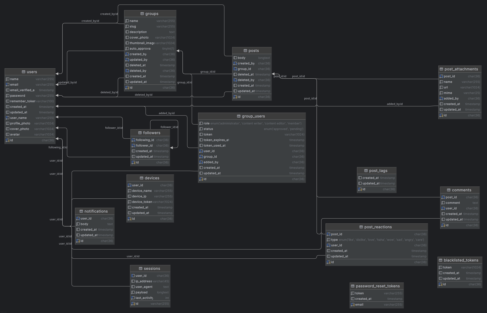

# Tafaling API

Prepared By: Newton Mitro

### PSR-2: Coding Style Guide

Please read [codding style guide](https://webdevetc.com/blog/laravel-naming-conventions/) before codding

### Contribution Guide

```
// Clone repository with your personal repository URL
git clone your-personal-repository-url

// Open project with your favourite text-editor/IDE
// On the terminal
// Fetch all branches from remote
// To check which branch has update or
// Is there any new remote branch
git fetch
// Or
git fetch origin

// There will be a branch named develop
// Switch to the develop branch
git switch develop

// According to Task/Issue/Feature create your branch for an example-
git branch auth-feature

// Commit your change frequently
git add .
git add file_name
git commit -m "AuthRoutes.php file added"

// After task is complete,
// Check if develop branch has any update by
git fetch
// Or
git fetch origin

// If Develop branch has update then
// Pull from the develop branch (stay update with develop branch)
git pull origin develop

// Run all the test
php artisan test

// If all the test is ok and nothing is broken
// And your code is ok then push your branch to the remote repositoy
git push origin auth-feature

// Then ask branch-master to marge your branch with the develop branch
// Rbranch-master will check your branch
// If He/She find anything wrong
// Then He/She will tell you to fix that problem
// After fixing the problem you will push your branch again and inform branch-master
// This process will continue until everything is ok
// Then He/She will marge your branch your with develop branch and
// Delete your branch from remote

// ++++++++++++++++++++++++++++++++++++++++++++++++
// +++++++++++ Some useful git command ++++++++++++
// ++++++++++++++++++++++++++++++++++++++++++++++++

// Show all local branches
git branch

// Create new branch from current branch
git branch branch_name

// Switch/Checkout branch
git switch branch_name
git checkout branch_name

// File tracking status
git status

// Add modified files to staged area
git add file_name

// or add all files to staged area
git add .

// remove file from staged area or unstage
git restore --staged <filename>

// Commit changes with message
git commit -m "README.md updated"

// Delete remote branch
git push -d origin branch_name

// Delete local branch (if everything commited and marged)
git branch -d branch_name

// Delete local branch frocefully
git branch -D branch_name

// Marge new-featur branch with develop branch
git switch develop
git merge --no-ff new-feature
git branch -d new-feature


```

### Code Formatting, Fixing & Others Commands

```
// Laravel/Print (Code format fix)
./vendor/bin/pint

./vendor/bin/pint --repair

// Rector Fix Command (Code Formatting and Fixing)
composer run rector-fix

// Create .env from .evn.example
composer run post-root-package-install

// Generate App Key, mysql db, and migrate command
composer run post-create-project-cmd

// Clear Storage Log
truncate -s 0 storage/logs/laravel.log

composer dump-autoload
php artisan optimize:clear
```

## Entity Relationship Diagram

[//]: # ""




## Use Cases

### Auth

-   register
-   verify-email [TODO]
-   verify-mobile-number [???]
-   auth-user
-   login
-   logout
-   refresh-token
-   forgot-password [TODO]
-   reset-password [TODO] [Password History ???]

### User

-   find-user-by-id
-   find-user-by-email
-   find-user-by-user-name
-   change-password
-   update-cover-photo
-   update-avatar
-   update-profile-picture
-   delete-account (Soft deleted - after 1 month delete permanently)

### User Password

-   store-user-password (old password)
-   check-if-user-password-hash-exist

### Profile

-   Contact info
    -   update-or-create-contact-info
-   Basic info
    -   update-or-crate-basic-info
-   Work and education
    -   ???
-   Family and relationships
    -   ???
-   Bio
    -   update-or-create-bio

### Device

(On the client side create a unique-id/device-Id if it does not exits - ex. id, send device-id and other useful device
info during login and device-id for logout and refresh-token request)

-   update-or-add-device-token
-   find-device-by-token
-   find-device-by-user-id-and-device-name
-   list-user-logged-in-devices
-   remove-all-devices/logout-from-all-devices

### Blacklist Token

(While logging out block list access-token to the black list table and while token verifying check if given token exist
in the black list table. )

-   add-token-to-black-list
-   token-exist-in-the-black-list

### Group

-   create-group
-   find-group
-   Update-group

### Group Member (GroupsUsers)

-   list-group-members
-   assign-role-to-a-group-member (Administrator, Member, Owner)
-   join-to-a-group
-   approve-user-to-a-group
-   leave-from-group
-   kick-out-from-group

### Post (Aggregate Root)

-   create-post (body, feeling, visibility, at_location, background, attachments, tags, block) ??? Content-Type:
    multipart/form-data; boundary=something
-   update-post
-   update-post-visibility
-   delete-post
-   post-feed
-   get-user-posts
-   get-group-posts
-   get-post

For GET Request: (post, user, attachments, tags, total_reactions + by_reaction_category, total_shares,
total_comments, ???)

### Post Attachment

-   create-post-attachment
-   delete-post-attachment
-   list-post-attachments

### Post Tag

-   create-post-tag
-   delete-post-tag
-   list-post-tags

### Post Reaction

-   react-to-a-post

### Post Share

-   share-a-post

### Post Comment

-   add-comment-to-a-post
-   update-comment
-   remove-comment
-   list-post-comments

### Follower

-   follow-a-user
-   un-follow-a-user
-   get-user-followers
-   get-following-users

### My Day

### User Setting ???

### Report Post ???

### Report User ???

### Block List User ???

### Group Chat (Broadcast message to group members)

### Group Chat Attachment (Broadcast message to group members)

++++++++++++++++++++++++++++++++++++++++++++++++

### User Chat (User to User chat)

### User Chat Attachment (User to User chat)

++++++++++++++++++++++++++++++++++++++++++++++++

### Conversation-Group / Messenger-Group

### Conversation Members

### Conversation

### Conversation Attachment

++++++++++++++++++++++++++++++++++++++++++++++++

### Response Status Code

-   Informational responses (100 – 199)
-   Successful responses (200 – 299)
-   Redirection messages (300 – 399)
-   Client error responses (400 – 499)
-   Server error responses (500 – 599)

```php
class Response
{
    public const HTTP_CONTINUE = 100;
    public const HTTP_SWITCHING_PROTOCOLS = 101;
    public const HTTP_PROCESSING = 102;            // RFC2518
    public const HTTP_EARLY_HINTS = 103;           // RFC8297
    public const HTTP_OK = 200;
    public const HTTP_CREATED = 201;
    public const HTTP_ACCEPTED = 202;
    public const HTTP_NON_AUTHORITATIVE_INFORMATION = 203;
    public const HTTP_NO_CONTENT = 204;
    public const HTTP_RESET_CONTENT = 205;
    public const HTTP_PARTIAL_CONTENT = 206;
    public const HTTP_MULTI_STATUS = 207;          // RFC4918
    public const HTTP_ALREADY_REPORTED = 208;      // RFC5842
    public const HTTP_IM_USED = 226;               // RFC3229
    public const HTTP_MULTIPLE_CHOICES = 300;
    public const HTTP_MOVED_PERMANENTLY = 301;
    public const HTTP_FOUND = 302;
    public const HTTP_SEE_OTHER = 303;
    public const HTTP_NOT_MODIFIED = 304;
    public const HTTP_USE_PROXY = 305;
    public const HTTP_RESERVED = 306;
    public const HTTP_TEMPORARY_REDIRECT = 307;
    public const HTTP_PERMANENTLY_REDIRECT = 308;  // RFC7238
    public const HTTP_BAD_REQUEST = 400;
    public const HTTP_UNAUTHORIZED = 401;
    public const HTTP_PAYMENT_REQUIRED = 402;
    public const HTTP_FORBIDDEN = 403;
    public const HTTP_NOT_FOUND = 404;
    public const HTTP_METHOD_NOT_ALLOWED = 405;
    public const HTTP_NOT_ACCEPTABLE = 406;
    public const HTTP_PROXY_AUTHENTICATION_REQUIRED = 407;
    public const HTTP_REQUEST_TIMEOUT = 408;
    public const HTTP_CONFLICT = 409;
    public const HTTP_GONE = 410;
    public const HTTP_LENGTH_REQUIRED = 411;
    public const HTTP_PRECONDITION_FAILED = 412;
    public const HTTP_REQUEST_ENTITY_TOO_LARGE = 413;
    public const HTTP_REQUEST_URI_TOO_LONG = 414;
    public const HTTP_UNSUPPORTED_MEDIA_TYPE = 415;
    public const HTTP_REQUESTED_RANGE_NOT_SATISFIABLE = 416;
    public const HTTP_EXPECTATION_FAILED = 417;
    public const HTTP_I_AM_A_TEAPOT = 418;                                               // RFC2324
    public const HTTP_MISDIRECTED_REQUEST = 421;                                         // RFC7540
    public const HTTP_UNPROCESSABLE_ENTITY = 422;                                        // RFC4918
    public const HTTP_LOCKED = 423;                                                      // RFC4918
    public const HTTP_FAILED_DEPENDENCY = 424;                                           // RFC4918
    public const HTTP_TOO_EARLY = 425;                                                   // RFC-ietf-httpbis-replay-04
    public const HTTP_UPGRADE_REQUIRED = 426;                                            // RFC2817
    public const HTTP_PRECONDITION_REQUIRED = 428;                                       // RFC6585
    public const HTTP_TOO_MANY_REQUESTS = 429;                                           // RFC6585
    public const HTTP_REQUEST_HEADER_FIELDS_TOO_LARGE = 431;                             // RFC6585
    public const HTTP_UNAVAILABLE_FOR_LEGAL_REASONS = 451;                               // RFC7725
    public const HTTP_INTERNAL_SERVER_ERROR = 500;
    public const HTTP_NOT_IMPLEMENTED = 501;
    public const HTTP_BAD_GATEWAY = 502;
    public const HTTP_SERVICE_UNAVAILABLE = 503;
    public const HTTP_GATEWAY_TIMEOUT = 504;
    public const HTTP_VERSION_NOT_SUPPORTED = 505;
    public const HTTP_VARIANT_ALSO_NEGOTIATES_EXPERIMENTAL = 506;                        // RFC2295
    public const HTTP_INSUFFICIENT_STORAGE = 507;                                        // RFC4918
    public const HTTP_LOOP_DETECTED = 508;                                               // RFC5842
    public const HTTP_NOT_EXTENDED = 510;                                                // RFC2774
    public const HTTP_NETWORK_AUTHENTICATION_REQUIRED = 511;
}
```

### Response Object

```json
{
    "data": "array|object|string|null",
    "message": "string|null",
    "errors": {
        "email": ["The email field is required."],
        "password": ["The password field is required."]
    },
    "links": {
        "first": "",
        "last": "",
        "prev": null,
        "next": null
    },
    "meta": {
        "current_page": 1,
        "from": null,
        "last_page": 1,
        "links": [
            {
                "url": null,
                "label": "&laquo; Previous",
                "active": false
            },
            {
                "url": "http://127.0.0.1:8001?page=1",
                "label": "1",
                "active": true
            },
            {
                "url": null,
                "label": "Next &raquo;",
                "active": false
            }
        ],
        "path": "http://127.0.0.1:8001",
        "per_page": 15,
        "to": null,
        "total": 0
    }
}
```

**Success** or **failure** will depend on the response **status code**.

### Upload Files and key-value pair data request sample (for creating/updating post)

Content-Type: multipart/form-data; boundary=AaB03x

```http request
--AaB03x
Content-Disposition: form-data; name="submit-name"

Larry
--AaB03x
Content-Disposition: form-data; name="files"
Content-Type: multipart/mixed; boundary=BbC04y

--BbC04y
Content-Disposition: file; filename="file1.txt"
Content-Type: text/plain

... contents of file1.txt ...
--BbC04y
Content-Disposition: file; filename="file2.gif"
Content-Type: image/gif
Content-Transfer-Encoding: binary

...contents of file2.gif...
--BbC04y--
--AaB03x--
```

### The Pattern

Arrange-Act-Assert is a great way to structure test cases. It prescribes an order of operations:

1. **Arrange** inputs and targets. Arrange steps should set up the test case. Does the test require any objects or
   special settings? Does it need to prep a database? Does it need to log into a web app? Handle all of these operations
   at the start of the test.

2. **Act** on the target behavior. Act steps should cover the main thing to be tested. This could be calling a function
   or method, calling a REST API, or interacting with a web page. Keep actions focused on the target behavior.

3. **Assert** expected outcomes. Act steps should elicit some sort of response. Assert steps verify the goodness or
   badness of that response. Sometimes, assertions are as simple as checking numeric or string values. Other times, they
   may require checking multiple facets of a system. Assertions will ultimately determine if the test passes or fails.

Behavior-Driven Development follows the Arrange-Act-Assert pattern by another name: Given-When-Then. The Gherkin
language uses Given-When-Then steps to specify behaviors in scenarios. Given-When-Then is essentially the same formula
as Arrange-Act-Assert.

Every major programming language has at least one test framework. Frameworks like JUnit, NUnit, Cucumber, and (my
favorite) pytest enable you, as the programmer, to automate tests, execute suites, and report results. However, the
framework itself doesn’t make a test case “good” or “bad.” You, as the tester, must know how to write good tests!

Let’s look at how to apply the Arrange-Act-Assert pattern in Python code. I’ll use pytest for demonstration.

### Unit Testing

Here’s a basic unit test for Python’s absolute value function:

```php
describe('sum', function () {
   it('may sum integers', function () {
       $result = sum(1, 2);

       expect($result)->toBe(3);
    });

    it('may sum floats', function () {
       $result = sum(1.5, 2.5);

       expect($result)->toBe(4.0);
    });
});
```

This test may seem trivial, but we can use it to illustrate our pattern. I like to write comments denoting each phase of
the test case as well.

1. The Arrange step creates a variable named “negative” for testing.
2. The Act step calls the “abs” function using the “negative” variable and stores the returned value in a variable named
   “answer.”
3. The Assert step verifies that “answer” is a positive value.

### Feature Testing

Let’s kick it up a notch with a more complicated test. This next example tests the DuckDuckGo Instant Answer API using
the requests package:

```php
describe('login', function () {
    it('can be authenticated', function () {
        $user = User::factory()->create();
        $response = $this->post('/api/auth/login', [
            'email' => $user->email,
            'password' => 'password',
        ]);
        $this->assertAuthenticated();
        $this->assertAuthenticatedAs($user);
    }
    );
});
```

We can clearly see that the Arrange-Act-Assert pattern works for feature tests as well as unit tests.

1. The Arrange step forms the endpoint URL for searching for “Python Programming.” Notice the base URL and the query
   parameters.
2. The Act steps call the API using the URL using “requests” and then parse the response’s body from JSON into a Python
   dictionary.
3. The Assert steps then verify that the HTTP status code was 200, meaning “OK” or “success,” and that the word “Python”
   appears somewhere in the response’s abstract text.

Arrange-Act-Assert also works for other types of feature tests, like Web UI and mobile tests.

```php
// To run all test
php artisan test

// To run specific test
php artisan test --filter LoginTest
```

## Jenkins Setup
